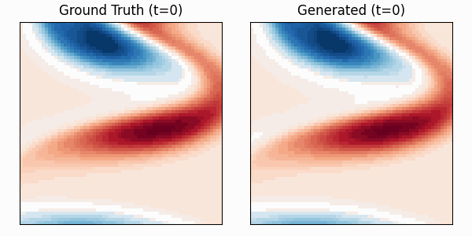

# Official Code for "[Elucidating the Design Choice of Probability Paths in Flow Matching for Forecasting](https://openreview.net/forum?id=JApMDLwbLR)" (TMLR 2025)

Flow matching has recently emerged as a powerful paradigm for generative modeling and has been extended to probabilistic time series forecasting in latent spaces. However, the impact of the specific choice of probability path model on forecasting performance remains under-explored. In this work, we demonstrate that forecasting spatio-temporal data with flow matching is highly sensitive to the selection of the probability path model. Motivated by this insight, we propose a novel probability path model designed to improve forecasting performance. Our empirical results across various dynamical system benchmarks show that our model achieves faster convergence during training and improved predictive performance compared to existing probability path models. Importantly, our approach is efficient during inference, requiring only a few sampling steps. This makes our proposed model practical for real-world applications and opens new avenues for probabilistic forecasting.

<p align="center">
  
</p>


This repository contains the official implementation of the methods and experiments described in the TMLR paper (the arxiv version is available [here](https://arxiv.org/abs/2410.03229)). For a standalone demonstration that applies a simplified version of the method to different tasks, see this [notebook](https://colab.research.google.com/drive/1SfB1VnHLU8nxq5qLQYb4bbOPzZ2XLm0E?usp=sharing).

## **Setup**

First, build the container image from `ours.def` (installs packages from `requirements.txt`):
```
apptainer build ours.sif ours.def
```

## **Running Examples**
Once you have created the directories for checkpoints and results, you can then run the provided simple examples inside the container:

```
apptainer exec ours.sif python train_ae.py \
  --run-name github_simpleflow_ae \
  --dataset simpleflow \
  --ae_option ae \
  --ae_epochs 2000 \
  --snapshots-per-sample 25 \
  --ae_lr_scheduler cosine \
  --ae_learning_rate 0.001
```

```
apptainer exec ours.sif python train.py \
  --run-name github_simpleflow_ours_sigma0.01_samplingsteps10_rk4_separate \
  --dataset simpleflow \
  --train_option separate \
  --probpath_option ours \
  --epochs 2000 \
  --sampling_steps 10 \
  --sigma 0.01 \
  --solver rk4 \
  --snapshots-per-sample 25 \
  --snapshots-to-generate 20 \
  --path_to_ae_checkpoints checkpoints/ \
  --path_to_results results/ \
  --save-plots \
  --save-gif
```

## Access to Datasets 
The dataset for the simple fluid flow task is included in this repository. The other datasets are provided by [PDEBench](https://github.com/pdebench/PDEBench) and can be downloaded from their official repository.

## Reproducibility Disclaimer
The quantitative results in the paper may not be precisely reproducible because the packages listed in `requirements.txt` install the latest versions, whereas the experiments in the paper were conducted using older versions of some dependencies. This can cause minor variations in results. For more consistent reproduction, we recommend using the specific package versions listed in `requirements_exact.txt`.

## **Citation**
If you find our work useful for your research, please consider citing our paper:
```
@article{lim2025elucidating,
  title={Elucidating the design choice of probability paths in flow matching for forecasting},
  author={Lim, Soon Hoe and Wang, Yijin and Yu, Annan and Hart, Emma and Mahoney, Michael W and Li, Xiaoye S and Erichson, N Benjamin},
  journal={Transaction on Machine Learning Research},
  year={2025}
}
```
